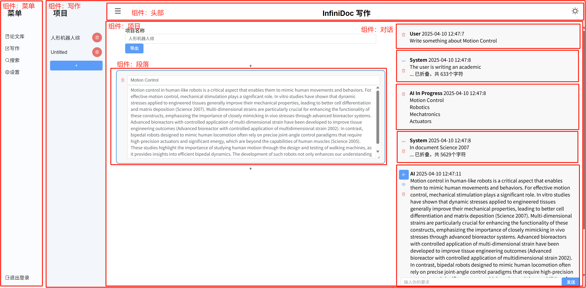
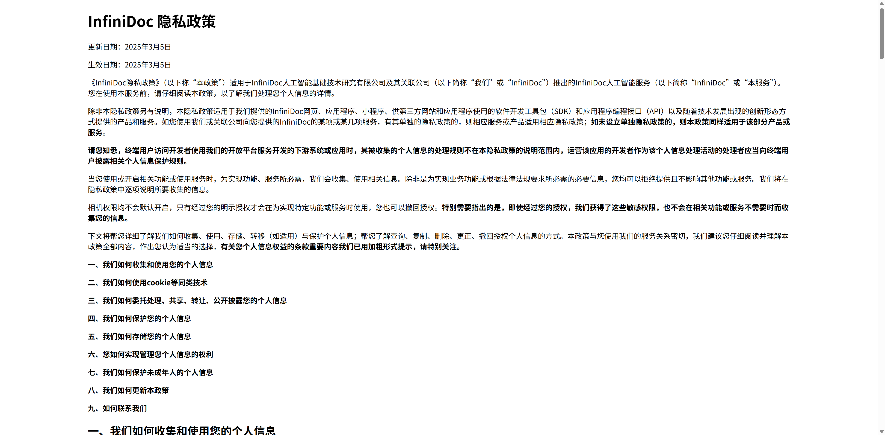
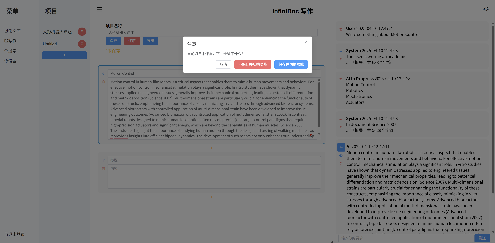
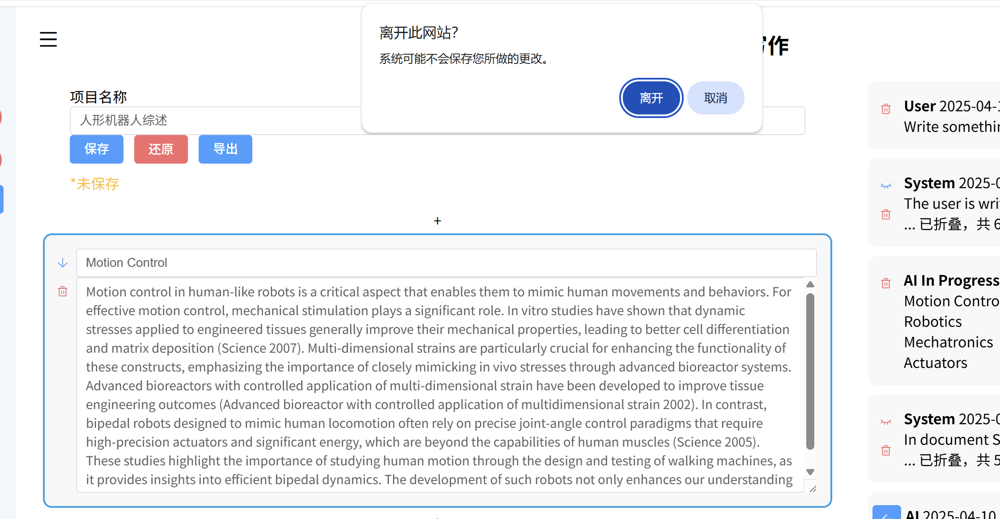

# 快速开始

## 服务器端的安装与配置

### MySQL

你需要安装 MySQL 数据库，测试使用的数据库是 MySQL 8.0。

你需要新建一个数据库，并给予用户访问这个数据库的权限，包括 `SELECT`、`INSERT`、`UPDATE`、`DELETE` 权限。

**非常**不建议使用 `root` 用户来访问数据库。

**非常**建议使用 `utf8mb4` 字符集。

需要创建以下的表

```sql
CREATE TABLE `files` (
  `id` int NOT NULL,
  `size` int NOT NULL,
  `sha256` varchar(64) NOT NULL
) ENGINE=InnoDB DEFAULT CHARSET=utf8mb4 COLLATE=utf8mb4_0900_ai_ci;
CREATE TABLE `tokens` (
  `token` varchar(64) NOT NULL,
  `time_accessed` bigint NOT NULL,
  `UNIQUE_ID` tinytext NOT NULL
) ENGINE=InnoDB DEFAULT CHARSET=utf8mb4 COLLATE=utf8mb4_0900_ai_ci;
CREATE TABLE `users` (
  `username` varchar(32) NOT NULL,
  `password` varchar(64) NOT NULL,
  `salt` varchar(32) NOT NULL,
  `id` int NOT NULL
) ENGINE=InnoDB DEFAULT CHARSET=utf8mb4 COLLATE=utf8mb4_0900_ai_ci;
CREATE TABLE `user_files` (
  `UNIQUE_ID` varchar(32) NOT NULL,
  `fileid` int NOT NULL,
  `name` text NOT NULL,
  `seq` int NOT NULL
) ENGINE=InnoDB DEFAULT CHARSET=utf8mb4 COLLATE=utf8mb4_0900_ai_ci;
CREATE TABLE `user_projects` (
  `UNIQUE_ID` varchar(32) NOT NULL,
  `project_id` int NOT NULL,
  `project_name` text NOT NULL,
  `paragraphs` mediumtext NOT NULL,
  `deleted` tinyint(1) NOT NULL DEFAULT '0'
) ENGINE=InnoDB DEFAULT CHARSET=utf8mb4 COLLATE=utf8mb4_0900_ai_ci;
CREATE TABLE `user_settings` (
  `UNIQUE_ID` varchar(32) NOT NULL,
  `setting` varchar(32) NOT NULL,
  `value` text NOT NULL
) ENGINE=InnoDB DEFAULT CHARSET=utf8mb4 COLLATE=utf8mb4_0900_ai_ci;
```

需要创建以下索引：

```sql
ALTER TABLE `files`
  ADD PRIMARY KEY (`id`);
ALTER TABLE `tokens`
  ADD UNIQUE KEY `token` (`token`);
ALTER TABLE `users`
  ADD PRIMARY KEY (`id`),
  ADD UNIQUE KEY `username` (`username`);
ALTER TABLE `user_files`
  ADD PRIMARY KEY (`seq`),
  ADD KEY `UNIQUE_ID` (`UNIQUE_ID`);
ALTER TABLE `user_projects`
  ADD PRIMARY KEY (`project_id`);
ALTER TABLE `user_settings`
  ADD PRIMARY KEY (`UNIQUE_ID`,`setting`);
```

设置自增属性：

```sql
ALTER TABLE `files`
  MODIFY `id` int NOT NULL AUTO_INCREMENT;
ALTER TABLE `users`
  MODIFY `id` int NOT NULL AUTO_INCREMENT;
ALTER TABLE `user_files`
  MODIFY `seq` int NOT NULL AUTO_INCREMENT;
ALTER TABLE `user_projects`
  MODIFY `project_id` int NOT NULL AUTO_INCREMENT;
COMMIT;
```

### Python

你需要安装 Python 3.11+，并建议使用 `venv` 创建一个虚拟环境。

然后，你需要确保安装在 `requirements.txt` 中的所有依赖。

```bash
pip install -r requirements.txt
```

你需要修改几个文件

`backend/dbpassword.py`，其模板是 `backend/dbpassword.py.default`，你需要将其复制一份，并修改其中的数据库连接信息。

`algo/keys.py`，其模板是 `algo/keys.py.default`，你需要将其复制一份，并修改其中的向量化 API 密钥信息。

此外，如果不使用 ssl，需要修改 `backend/server.py` 与 `algo/server.py`，删除 `ssl_keyfile=` 与 `ssl_certfile=` 两个参数。

> 注意，如果不使用 SSL，你还需要修改 `src/components/endpoints.js` 中的 `https://` 为 `http://`。

> 注意：由于在非 https 且非 localhost 访问时，Crypto 是不允许的，你需要找到 sha256 的替代方法。

如果你需要使用 ssl，需要在上述两个文件中，设置 `ssl_keyfile=` 与 `ssl_certfile=` 的值为你自己的证书文件。

### Chroma

由于使用了 Python 内建的持久化运行的 Chroma 客户端，因此只需要安装 ChromaDB 并确定其与 Python 配合良好即可。

### Pandoc

文献的多格式导出功能依赖于后端，后端使用 Pandoc 实现将 Markdown 转换为其他格式的功能。
你需要安装 Pandoc，并确保其在系统的 PATH 中。确保可以在命令行中运行 `pandoc` 命令。

## 启动服务器

对于 Windows，我们提供了一个 `run.bat` 文件，你或许需要修改其中的 python 路径。

对于 Linux 和 macOS，你需要手动运行 `backend/server.py` 和 `algo/server.py`。

## 前端运行

这非常简单，你只需要安装 NodeJS 18+，然后运行以下命令：

```bash
npm install
```

要运行，你只需要运行以下命令：

```bash
npm run serve
```

要构建，你只需要运行以下命令：

```bash
npm run build
```

# 前端文档

## 项目文件结构

-   components/

    -   NotLoggedInView.vue 登录前主页面
    -   NotLoggedInMenu.vue 登录前的侧边菜单
    -   PrivacyPolicy.vue 隐私政策页面
    -   headBar.vue 头部
    -   LoginView.vue 登录页面
    -   RegisterView.vue 注册页面
    -   HomeView.vue 登录后主页面
    -   Menu.vue 登录后侧边菜单
    -   Chat.vue 写作的主页面
    -   ChatSelect.vue 写作左面的选择项目列表
    -   Project.vue 项目的主页面
    -   Dialog.vue 单个对话
    -   Paragraph.vue 单个段落
    -   Papers.vue 论文库的主页面
    -   Search.vue 搜索的主页面
    -   SearchResultCard.vue 搜索结果卡片
    -   Setting.vue 设置的主页面
    -   endpoints.js 用于定义 API 地址
    -   tauth.js 用于处理用户认证

-   css/

    -   homestyle.css 用于处理登录后页面的样式
    -   style.css 用于处理整体的样式
    -   loginstyle.css 用于处理登录页面的样式
    -   vscode-darkplus.css 代码高亮样式
    -   docstyle.css 隐私政策样式

## 技术栈

-   使用 Vue3 作为前端框架
-   使用 Webpack 作为构建及调试工具
-   使用 Element Plus 作为 UI 组件库
-   使用 Babel 作为编译器
-   使用 marked 作为 Markdown 解析器
-   使用 highlight.js 作为代码高亮工具

## 页面结构

总地来说，路径一共有 5 个：

-   登录前页面
-   登录页面
-   注册页面
-   条款页面
-   登录后页面（主页面）

其中在主页面内的组件实现了功能切换，但并不会改变路径。

可能切换的组件有：

-   设置
-   论文库
-   搜索
-   写作

复用的组件有：

-   头部，通过 Slot 传入不同的标题
-   侧边菜单
-   对话（即一个聊天）文字过长时自动折叠（会自动识别单词，不会在单词中间折叠）
-   段落
-   搜索结果卡片







## 实现功能

### 深色模式

实现了深色和浅色两套配色，进入页面时根据用户的系统设置自动选择深色或浅色模式，用户可以在页面右上角手动切换深色和浅色模式。


### 画面过渡

使用 Vue 的过渡组件实现了页面切换时的过渡效果，使用 CSS 的 transition 属性实现了元素的过渡效果。

### 弹性布局

使用 CSS 的 Flexbox 实现了页面的弹性布局。通过设置元素的 `display: flex` 和 `flex-direction` 属性实现了元素的排列方式。

另外，使用了 `resize` 属性，支持用户拖动更改各个组件的大小。

### 上传页面

使用 Element Plus 的 Upload 组件实现了文件上传功能，支持拖拽上传和点击选择文件上传。


### Websocket 实现 LLM 的流式推理

使用 Websocket 实现了 LLM 的流式推理，使用了 Vue 的响应式系统实现了数据的双向绑定。当接收到 Websocket 数据包时，将数据包中的数据解析并更新到页面上。

### 打断切换

当用户有改动未保存时，点击切换组件会弹出提示框，询问用户是否保存改动，也会 hook 浏览器关闭事件，询问用户是否确定离开。




## API 调用

在 localStorage 中存储了 Token，在每次请求时从 localStorage 中获取 Token，并将 Token 添加到请求头中。

每次打开页面时，前端会自动校验 Token 的有效性，如果 Token 无效，则跳转到登录页面。

## 编辑器

本项目的思想是一个 Web App，因此在编辑的全程（除非调用接口）是无需与后端交互的。在导出时，前端可以将内容生成一个 Markdown，但对于其他格式，会调用后端接口提供格式转换。

# 后端技术实现文档

该文档介绍后端的具体实现。

## 项目文件结构

-   server.py 用于启动 uvicorn 服务器
-   main.py 定义服务器，提供 router，引入其他 router，包括 Websocket 的处理
-   schemas.py 定义请求体
-   tauthAuthenticator.py 对接第三方认证系统的支持库
-   authenticate.py 认证系统的实现
-   filel.py 文件上传与解析的实现，包括删除和更改操作
-   projectManager.py 项目管理的实现，包括保存和加载操作
-   largeModel.py LLM 交互相关的实现，包括核心的对话逻辑
-   route_file.py 文件上传与解析的路由
-   route_project.py 项目管理的路由
-   route_settings.py 设置与自定义
-   route_user.py 用户管理的路由，包括注册、登录、注销等操作
-   dbpassword.py(.default) 数据库密码

## 用户管理

### 用户相关数据库表设计

主要涉及以下两个表：

```sql
CREATE TABLE `tokens` (
  `token` varchar(64) NOT NULL,
  `time_accessed` bigint NOT NULL,
  `UNIQUE_ID` tinytext NOT NULL
) ENGINE=InnoDB DEFAULT CHARSET=utf8mb4 COLLATE=utf8mb4_0900_ai_ci;
CREATE TABLE `users` (
  `username` varchar(32) NOT NULL,
  `password` varchar(64) NOT NULL,
  `salt` varchar(32) NOT NULL,
  `id` int NOT NULL
) ENGINE=InnoDB DEFAULT CHARSET=utf8mb4 COLLATE=utf8mb4_0900_ai_ci;
```

```sql
ALTER TABLE `tokens`
  ADD UNIQUE KEY `token` (`token`);
ALTER TABLE `users`
  ADD PRIMARY KEY (`id`),
  ADD UNIQUE KEY `username` (`username`);
```

用户名不应当重复。

注意到有大量检索 token 的需求，因此我们在 `tokens` 表中添加了索引。

```sql
ALTER TABLE `users`
  MODIFY `id` int NOT NULL AUTO_INCREMENT;
```

`tokens` 表用于存储用户的 token 信息，这是前端调用后端 API 的凭证。`token` 在登录时被生成，存储在数据库中。`time_accessed` 用于记录 token 的最后访问时间，便于后续的 token 过期处理。`UNIQUE_ID` 用于标识用户的唯一身份。这用于唯一标识用户，便于后续的权限管理和数据隔离。

`users` 表用于存储用户的基本信息，包括用户名、密码和盐值。密码经过加密存储，盐值用于增强密码的安全性。`id` 是用户的唯一标识符，用于在系统中区分不同的用户。请注意，这里只维护在本站点注册的用户的信息，第三方登录不储存在其中。此外，这里的 `id` 和上述的 `unique_id` 不同，但存在一一对应关系（但存在 `unique_id` 的用户不一定存在 `id`）。

### 注册与登录

用户注册与登录的功能主要通过 `POST` 请求实现。详见 API 文档。

密码存储：使用了 哈希(哈希(密码)+盐值) 的方式存储密码，即防止被彩虹表攻击。

**注意，由于默认启用 https，可认为使用 POST 传输明文密码是安全的。但即便如此，我们仍然在前端计算第一层的哈希值。**

校验用户名格式：应当为大小写字母、数字和`-_` 组成，长度为 4-32 位。

> 我们默认用户应该对其密码安全性负责，因此不对密码的复杂性进行校验。

### 第三方登录

用户先向第三方平台申请一个令牌，然后后端将向第三方平台发送请求，以验证该令牌的有效性并获取用户的标识符。

如果验证成功，后端将生成一个 token 返回给前端。前端可以使用该 token 进行后续的 API 调用。

### Token

用户在访问不显式涉及 Token 的 API 时，后端会自动从请求头中提取 Token。

## 设置与自定义 LLM

### 设置与自定义 LLM 的数据库表设计

```sql
CREATE TABLE `user_settings` (
  `UNIQUE_ID` varchar(32) NOT NULL,
  `setting` varchar(32) NOT NULL,
  `value` text NOT NULL
) ENGINE=InnoDB DEFAULT CHARSET=utf8mb4 COLLATE=utf8mb4_0900_ai_ci;
```

```sql
ALTER TABLE `user_settings`
  ADD PRIMARY KEY (`UNIQUE_ID`,`setting`);
```

用户 ID 和设置项作为联合主键。
`setting` 用于标识设置项的名称，`value` 用于存储设置项的值。

### 自定义 LLM 的模型获取

```python
def get_models(endpoint, api_key):
    try:
        client = OpenAI(
            api_key=api_key,
            base_url=endpoint
        ) if api_key != "" else OpenAI(
            base_url=endpoint
        )
        models = client.models.list()
        return models
    except Exception as e:
        return []
```

可以直接使用 OpenAI 的 API 获取模型列表。

### 自定义 LLM 的测试

这实际上是一个非常基础的对话调用。但在此我们一并讲述异步调用的实现。

```python
async def get_ai_response(message: str, client: AsyncOpenAI, model: str) -> AsyncGenerator[str, None]:
    response = await client.chat.completions.create(
        model=model,
        messages=[
            {
                "role": "system",
                "content": (
                    "You are a helpful assistant, skilled in explaining "
                    "complex concepts in simple terms."
                ),
            },
            {
                "role": "user",
                "content": message,
            },
        ],
        stream=True,
    )

    all_content = ""
    async for chunk in response:
        content = chunk.choices[0].delta.content
        if content:
            all_content += content
            yield content
```

这可以当大模型流式返回一些内容时，逐步返回给前端。每 `yield` 一次，前端就会收到一次数据。

`WebSocket` 是一个长连接，它主要是解决“后端不能主动推送数据给前端”的问题。解决了轮询带来的性能损失。

## 论文库管理

### 论文库相关数据库表设计

```sql
CREATE TABLE `files` (
  `id` int NOT NULL,
  `size` int NOT NULL,
  `sha256` varchar(64) NOT NULL
) ENGINE=InnoDB DEFAULT CHARSET=utf8mb4 COLLATE=utf8mb4_0900_ai_ci;
CREATE TABLE `user_files` (
  `UNIQUE_ID` varchar(32) NOT NULL,
  `fileid` int NOT NULL,
  `name` text NOT NULL,
  `seq` int NOT NULL
) ENGINE=InnoDB DEFAULT CHARSET=utf8mb4 COLLATE=utf8mb4_0900_ai_ci;
```

```sql
ALTER TABLE `files`
  ADD PRIMARY KEY (`id`);
ALTER TABLE `user_files`
  ADD PRIMARY KEY (`seq`),
  ADD KEY `UNIQUE_ID` (`UNIQUE_ID`);
```

注意我们并不禁止用户将同一个文件上传多次。它对应不同的 `seq` 值。

### 文件上传与解析

文件管理系统分离为两个部分：硬盘上文件与数据库中文件的对应关系 与 用户与数据库中文件的对应关系。

将计算用户上传文件的 `sha256` 值，若数据库中文件已有该值，则只需要维护数据库中文件与用户的对应关系。

否则，需要将该文件保存至对应目录（以 `sha256` 的前两位为目录），并在数据库中插入一条记录。

### 文件删除

注意到，文件删除不仅应该删除用户与数据库中文件的对应关系，还应当删除在向量数据库中的数据。

注意，我们设计即使用户完全删除了文件，即不存在任何该文件与用户的对应关系，但磁盘上仍然保留该文件。这是监管合规的要求。

然后通知向量数据库（算法层）删除该文件对应的记录。

### 分页查询

只需要使用 `LIMIT` 和 `OFFSET` 即可实现，注意 OFFSET 的值应当为 `page * batch_size`，其中 `page` 从 0 开始。

```python
mysql_cursor.execute(
        "SELECT `name`,(SELECT size from `files` where `id`=`fileid`),`seq` FROM `user_files` WHERE `UNIQUE_ID`=%s ORDER BY `seq` DESC LIMIT %s OFFSET %s;", (unique_id, batch_size, offset))
```

## 项目管理

### 项目相关数据库表设计

```sql
CREATE TABLE `user_projects` (
  `UNIQUE_ID` varchar(32) NOT NULL,
  `project_id` int NOT NULL,
  `project_name` text NOT NULL,
  `paragraphs` mediumtext NOT NULL,
  `deleted` tinyint(1) NOT NULL DEFAULT '0'
) ENGINE=InnoDB DEFAULT CHARSET=utf8mb4 COLLATE=utf8mb4_0900_ai_ci;
```

```sql
ALTER TABLE `user_projects`
  ADD PRIMARY KEY (`project_id`);
ALTER TABLE `user_projects`
  MODIFY `project_id` int NOT NULL AUTO_INCREMENT;
```

其中 paragraphs 保存的是 JSON 格式的字符串，表示该项目的段落信息。

### 保存与加载

这里其实值得讨论的是：应该向数据库塞一整个数据包（对应一个项目），还是将项目的各个段落拆开，标题拆开，分别存储？我认为各有优劣，但主流的还是存整个数据包。具体原因在于：前端实际上相当于一个 Web App，考虑我们日常编写 Word 等文档的习惯，都是将整个文档存储为一个文件，而不是将每一段文字都存储为一个文件。另外，这样做相当于把打包和解包的工作分散到前端。

### 删除

使用 `deleted` 字段来标记项目是否被删除，而不是直接删除该条记录。这可以实现回收站操作，以及确保合规性审查。

### 对话与写作

每一次段落写作其实可以认为是一个工作流。


注意到，我们实际上并没有也不需要实现上下文的保存，只是提供了当前段落的内容。这就可以完成诸如“请帮我改成学术论文的语气”之类的需求。

## 与算法层交互

使用 RESTFul API 的方式与算法层交互。

# API 文档

该文档介绍前后端交互接口

## RESTful API

### Verify Token （验证 Token）

| 方法 | URL                |
| ---- | ------------------ |
| POST | /login/verifyToken |

#### 请求体

| Field | 类型   | 详细 | 必须 |
| ----- | ------ | ---- | ---- |
| token | string |      | 必须 |

#### 响应 (200)

| Field   | 类型    | 详细             |
| ------- | ------- | ---------------- |
| success | boolean | 是否为有效 Token |

---

### Login With Tauth （使用 Tauth 登录）

| 方法 | URL          |
| ---- | ------------ |
| POST | /login/tauth |

#### 请求体

| Field | 类型   | 详细                            | 必须 |
| ----- | ------ | ------------------------------- | ---- |
| token | string | TAuth（第三方平台）提供的 Token | 必须 |

#### 响应 (200)

| Field   | 类型    | 详细               |
| ------- | ------- | ------------------ |
| success | boolean | 是否成功登录       |
| token   | string  | 登录后返回的 token |

---

### Register （注册）

| 方法 | URL              |
| ---- | ---------------- |
| POST | /register/native |

#### 参数

| Name | In  | 详细 | 必须 |
| ---- | --- | ---- | ---- |

#### 请求体

| Field    | 类型   | 详细                        | 必须 |
| -------- | ------ | --------------------------- | ---- |
| username | string | 用户名                      | 必须 |
| password | string | 密码（已经进行一次 sha256） | 必须 |

#### 响应 (200)

| Field   | 类型    | 详细         |
| ------- | ------- | ------------ |
| success | boolean | 是否成功注册 |
| token   | string  | 返回的 token |

---

### Login （登录）

| 方法 | URL           |
| ---- | ------------- |
| POST | /login/native |

#### 请求体

| Field    | 类型   | 详细   | 必须 |
| -------- | ------ | ------ | ---- |
| username | string | 用户名 | 必须 |
| password | string | 密码   | 必须 |

#### 响应 (200)

| Field   | 类型    | 详细         |
| ------- | ------- | ------------ |
| success | boolean | 是否成功登录 |
| token   | string  | 返回的 token |

---

### Convert File （转换文件）

| 方法 | URL      |
| ---- | -------- |
| POST | /convert |

#### 请求体

| Field    | 类型   | 详细                 | 必须 |
| -------- | ------ | -------------------- | ---- |
| markdown | string | 源文档 Markdown 格式 | 必须 |
| target   | string | 目标格式             | 必须 |

#### 响应 (200)

一个 Octet Stream，表示转换后的文件

---

### Upload File （上传文件）

| 方法 | URL     |
| ---- | ------- |
| POST | /upload |

#### 参数

| Name           | In     | 详细 | 必须 |
| -------------- | ------ | ---- | ---- |
| infiniDocToken | header |      | 必须 |

#### 请求体

| Field | 类型 | 详细       | 必须 |
| ----- | ---- | ---------- | ---- |
| file  | file | 上传的文件 | 必须 |

#### 响应 (200)

即表示上传成功

---

### File List （文件列表）

| 方法 | URL       |
| ---- | --------- |
| GET  | /fileList |

#### 参数

| Name           | In     | 详细             | 必须 |
| -------------- | ------ | ---------------- | ---- |
| limit          | query  | 最多返回的个数   | 必须 |
| offset         | query  | 从哪一个开始查询 | 必须 |
| infiniDocToken | header |                  | 必须 |

#### 响应 (200)

| Field      | 类型    | 详细     |
| ---------- | ------- | -------- |
| files      | array   | 文件列表 |
| totalfiles | integer | 文件总数 |

---

### Download File （下载文件）

| 方法 | URL       |
| ---- | --------- |
| GET  | /download |

#### 参数

| Name           | In     | 详细       | 必须 |
| -------------- | ------ | ---------- | ---- |
| seq            | query  | 哪一个文件 | 必须 |
| infiniDocToken | header |            | 必须 |

#### 响应 (200)

一个 Octet Stream，表示下载的文件

---

### Delete File （删除文件）

| 方法 | URL     |
| ---- | ------- |
| GET  | /delete |

#### 参数

| Name           | In     | 详细 | 必须 |
| -------------- | ------ | ---- | ---- |
| seq            | query  |      | 必须 |
| infiniDocToken | header |      | 必须 |

#### 响应 (200)

| Field   | 类型    | 详细         |
| ------- | ------- | ------------ |
| success | boolean | 是否成功删除 |

---

### Search In Files （在文件中搜索）

| 方法 | URL     |
| ---- | ------- |
| GET  | /search |

#### 参数

| Name           | In     | 详细   | 必须 |
| -------------- | ------ | ------ | ---- |
| keyword        | query  | 关键词 | 必须 |
| infiniDocToken | header |        | 必须 |

#### 响应 (200)

| Field  | 类型   | 详细     |
| ------ | ------ | -------- |
| result | object | 搜索结果 |

---

### Get Projects （获取项目列表）

| 方法 | URL          |
| ---- | ------------ |
| GET  | /project/get |

#### 参数

| Name           | In     | 详细 | 必须 |
| -------------- | ------ | ---- | ---- |
| infiniDocToken | header |      | 必须 |

#### 响应 (200)

| Field    | 类型  | 详细     |
| -------- | ----- | -------- |
| projects | array | 项目列表 |

---

### Create Project （创建项目）

| 方法 | URL             |
| ---- | --------------- |
| POST | /project/create |

#### 参数

| Name           | In     | 详细 | 必须 |
| -------------- | ------ | ---- | ---- |
| infiniDocToken | header |      | 必须 |

#### 请求体

| Field        | 类型   | 详细     | 必须 |
| ------------ | ------ | -------- | ---- |
| project_name | string | 项目名称 | 必须 |

#### 响应 (200)

| Field   | 类型    | 详细             |
| ------- | ------- | ---------------- |
| success | boolean | 是否成功创建项目 |
| id      | integer | 项目 ID          |

---

### Delete Project （删除项目）

| 方法 | URL             |
| ---- | --------------- |
| POST | /project/delete |

#### 参数

| Name           | In     | 详细 | 必须 |
| -------------- | ------ | ---- | ---- |
| infiniDocToken | header |      | 必须 |

#### 请求体

| Field      | 类型    | 详细    | 必须 |
| ---------- | ------- | ------- | ---- |
| project_id | integer | 项目 ID | 必须 |

#### 响应 (200)

| Field   | 类型    | 详细             |
| ------- | ------- | ---------------- |
| success | boolean | 是否成功删除项目 |

---

### Rename Project （重命名项目）

| 方法 | URL                          |
| ---- | ---------------------------- |
| POST | /project/rename/{project_id} |

#### 参数

| Name           | In     | 详细    | 必须 |
| -------------- | ------ | ------- | ---- |
| project_id     | path   | 项目 ID | 必须 |
| infiniDocToken | header |         | 必须 |

#### 请求体

| Field    | 类型   | 详细   | 必须 |
| -------- | ------ | ------ | ---- |
| new_name | string | 新名称 | 必须 |

#### 响应 (200)

| Field   | 类型    | 详细               |
| ------- | ------- | ------------------ |
| success | boolean | 是否成功重命名项目 |

---

### Get Paragraphs （获取项目段落）

| 方法 | URL                                 |
| ---- | ----------------------------------- |
| GET  | /project/getparagraphs/{project_id} |

#### 参数

| Name           | In     | 详细    | 必须 |
| -------------- | ------ | ------- | ---- |
| project_id     | path   | 项目 ID | 必须 |
| infiniDocToken | header |         | 必须 |

#### 响应 (200)

| Field      | 类型   | 详细      |
| ---------- | ------ | --------- |
| paragraphs | string | 段落 json |

---

### Get Project Name （获取项目名称）

| 方法 | URL                        |
| ---- | -------------------------- |
| GET  | /project/name/{project_id} |

#### 参数

| Name           | In     | 详细    | 必须 |
| -------------- | ------ | ------- | ---- |
| project_id     | path   | 项目 ID | 必须 |
| infiniDocToken | header |         | 必须 |

#### 响应 (200)

| Field        | 类型   | 详细     |
| ------------ | ------ | -------- |
| project_name | string | 项目名称 |

---

### Save Project

| 方法 | URL                        |
| ---- | -------------------------- |
| POST | /project/save/{project_id} |

#### 参数

| Name           | In     | 详细    | 必须 |
| -------------- | ------ | ------- | ---- |
| project_id     | path   | 项目 ID | 必须 |
| infiniDocToken | header |         | 必须 |

#### 请求体

| Field      | 类型   | 详细      | 必须 |
| ---------- | ------ | --------- | ---- |
| paragraphs | string | 段落 json | 必须 |

#### 响应 (200)

| Field   | 类型    | 详细             |
| ------- | ------- | ---------------- |
| success | boolean | 是否成功保存项目 |

---

### Get Unique Id （获取唯一 ID）

| 方法 | URL                   |
| ---- | --------------------- |
| POST | /settings/getUniqueID |

#### 参数

| Name | In  | 详细 | 必须 |
| ---- | --- | ---- | ---- |

#### 请求体

| Field | 类型   | 详细 | 必须 |
| ----- | ------ | ---- | ---- |
| token | string |      | 必须 |

#### 响应 (200)

| Field     | 类型   | 详细    |
| --------- | ------ | ------- |
| unique_id | string | 唯一 ID |

---

### Get User Settings （获取用户设置）

| 方法 | URL            |
| ---- | -------------- |
| GET  | /user/settings |

#### 参数

| Name           | In     | 详细 | 必须 |
| -------------- | ------ | ---- | ---- |
| infiniDocToken | header |      | 必须 |

#### 响应 (200)

| Field    | 类型    | 详细             |
| -------- | ------- | ---------------- |
| success  | boolean | 是否成功获取设置 |
| settings | object  | 用户设置         |

---

### Set User Settings （设置用户设置）

| 方法 | URL                |
| ---- | ------------------ |
| POST | /user/settings/set |

#### 参数

| Name           | In     | 详细 | 必须 |
| -------------- | ------ | ---- | ---- |
| infiniDocToken | header |      | 必须 |

#### 请求体

| Field   | 类型   | 详细     | 必须 |
| ------- | ------ | -------- | ---- |
| payload | object | 设置列表 | 必须 |

#### 响应 (200)

| Field   | 类型    | 详细         |
| ------- | ------- | ------------ |
| success | boolean | 是否成功设置 |

---

### Get Models （获取模型列表）

| 方法 | URL            |
| ---- | -------------- |
| POST | /llm/getModels |

#### 参数

| Name | In  | 详细 | 必须 |
| ---- | --- | ---- | ---- |

#### 请求体

| Field    | 类型   | 详细 | 必须 |
| -------- | ------ | ---- | ---- |
| endpoint | string |      | 必须 |
| api_key  | string |      | 必须 |

#### 响应 (200)

| Field  | 类型  | 详细     |
| ------ | ----- | -------- |
| （根） | array | 模型列表 |

## WebSocket API

### test （测试对话）

#### 请求体

| Field    | 类型   | 详细       | 必须 |
| -------- | ------ | ---------- | ---- |
| type     | string | 为 test    | 必须 |
| message  | string | 用户的信息 | 必须 |
| endpoint | string |            | 必须 |
| model    | string |            | 必须 |
| key      | string |            | 必须 |

### project （项目对话）

#### 请求体

| Field                     | 类型   | 详细         | 必须 |
| ------------------------- | ------ | ------------ | ---- |
| type                      | string | 为 project   | 必须 |
| project_name              | string | 项目名称     | 必须 |
| paragraph_title           | string | 段落标题     | 必须 |
| paragraph_current_content | string | 段落当前内容 | 必须 |
| user_prompt               | string | 用户要求     | 必须 |
