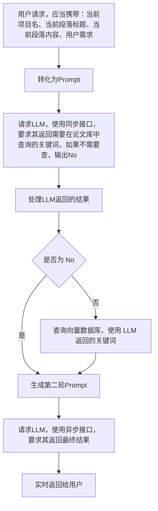

# 后端技术实现文档

该文档介绍后端的具体实现。

## 项目文件结构

-   server.py 用于启动 uvicorn 服务器
-   main.py 定义服务器，提供 router，引入其他 router，包括 Websocket 的处理
-   schemas.py 定义请求体

-   tauthAuthenticator.py 对接第三方认证系统的支持库
-   authenticate.py 认证系统的实现
-   filel.py 文件上传与解析的实现，包括删除和更改操作
-   projectManager.py 项目管理的实现，包括保存和加载操作
-   largeModel.py LLM 交互相关的实现，包括核心的对话逻辑

-   route_file.py 文件上传与解析的路由
-   route_project.py 项目管理的路由
-   route_settings.py 设置与自定义
-   route_user.py 用户管理的路由，包括注册、登录、注销等操作

-   dbpassword.py(.default) 数据库密码

## 用户管理

### 用户相关数据库表设计

主要涉及以下两个表：

```sql
CREATE TABLE `tokens` (
  `token` varchar(64) NOT NULL,
  `time_accessed` bigint NOT NULL,
  `UNIQUE_ID` tinytext NOT NULL
) ENGINE=InnoDB DEFAULT CHARSET=utf8mb4 COLLATE=utf8mb4_0900_ai_ci;
CREATE TABLE `users` (
  `username` varchar(32) NOT NULL,
  `password` varchar(64) NOT NULL,
  `salt` varchar(32) NOT NULL,
  `id` int NOT NULL
) ENGINE=InnoDB DEFAULT CHARSET=utf8mb4 COLLATE=utf8mb4_0900_ai_ci;
```

```sql
ALTER TABLE `tokens`
  ADD UNIQUE KEY `token` (`token`);
ALTER TABLE `users`
  ADD PRIMARY KEY (`id`),
  ADD UNIQUE KEY `username` (`username`);
```

用户名不应当重复。

注意到有大量检索 token 的需求，因此我们在 `tokens` 表中添加了索引。

```sql
ALTER TABLE `users`
  MODIFY `id` int NOT NULL AUTO_INCREMENT;
```

`tokens` 表用于存储用户的 token 信息，这是前端调用后端 API 的凭证。`token` 在登录时被生成，存储在数据库中。`time_accessed` 用于记录 token 的最后访问时间，便于后续的 token 过期处理。`UNIQUE_ID` 用于标识用户的唯一身份。这用于唯一标识用户，便于后续的权限管理和数据隔离。

`users` 表用于存储用户的基本信息，包括用户名、密码和盐值。密码经过加密存储，盐值用于增强密码的安全性。`id` 是用户的唯一标识符，用于在系统中区分不同的用户。请注意，这里只维护在本站点注册的用户的信息，第三方登录不储存在其中。此外，这里的 `id` 和上述的 `unique_id` 不同，但存在一一对应关系（但存在 `unique_id` 的用户不一定存在 `id`）。

### 注册与登录

用户注册与登录的功能主要通过 `POST` 请求实现。详见 API 文档。

密码存储：使用了 哈希(哈希(密码)+盐值) 的方式存储密码，即防止被彩虹表攻击。

**注意，由于默认启用 https，可认为使用 POST 传输明文密码是安全的。但即便如此，我们仍然在前端计算第一层的哈希值。**

校验用户名格式：应当为大小写字母、数字和`-_` 组成，长度为 4-32 位。

> 我们默认用户应该对其密码安全性负责，因此不对密码的复杂性进行校验。

### 第三方登录

用户先向第三方平台申请一个令牌，然后后端将向第三方平台发送请求，以验证该令牌的有效性并获取用户的标识符。

如果验证成功，后端将生成一个 token 返回给前端。前端可以使用该 token 进行后续的 API 调用。

### Token

用户在访问不显式涉及 Token 的 API 时，后端会自动从请求头中提取 Token。

## 设置与自定义 LLM

### 设置与自定义 LLM 的数据库表设计

```sql
CREATE TABLE `user_settings` (
  `UNIQUE_ID` varchar(32) NOT NULL,
  `setting` varchar(32) NOT NULL,
  `value` text NOT NULL
) ENGINE=InnoDB DEFAULT CHARSET=utf8mb4 COLLATE=utf8mb4_0900_ai_ci;
```

```sql
ALTER TABLE `user_settings`
  ADD PRIMARY KEY (`UNIQUE_ID`,`setting`);
```

用户 ID 和设置项作为联合主键。
`setting` 用于标识设置项的名称，`value` 用于存储设置项的值。

### 自定义 LLM 的模型获取

```python
def get_models(endpoint, api_key):
    try:
        client = OpenAI(
            api_key=api_key,
            base_url=endpoint
        ) if api_key != "" else OpenAI(
            base_url=endpoint
        )
        models = client.models.list()
        return models
    except Exception as e:
        return []
```

可以直接使用 OpenAI 的 API 获取模型列表。

### 自定义 LLM 的测试

这实际上是一个非常基础的对话调用。但在此我们一并讲述异步调用的实现。

```python
async def get_ai_response(message: str, client: AsyncOpenAI, model: str) -> AsyncGenerator[str, None]:
    response = await client.chat.completions.create(
        model=model,
        messages=[
            {
                "role": "system",
                "content": (
                    "You are a helpful assistant, skilled in explaining "
                    "complex concepts in simple terms."
                ),
            },
            {
                "role": "user",
                "content": message,
            },
        ],
        stream=True,
    )

    all_content = ""
    async for chunk in response:
        content = chunk.choices[0].delta.content
        if content:
            all_content += content
            yield content
```

这可以当大模型流式返回一些内容时，逐步返回给前端。每 `yield` 一次，前端就会收到一次数据。

`WebSocket` 是一个长连接，它主要是解决“后端不能主动推送数据给前端”的问题。解决了轮询带来的性能损失。

## 论文库管理

### 论文库相关数据库表设计

```sql
CREATE TABLE `files` (
  `id` int NOT NULL,
  `size` int NOT NULL,
  `sha256` varchar(64) NOT NULL
) ENGINE=InnoDB DEFAULT CHARSET=utf8mb4 COLLATE=utf8mb4_0900_ai_ci;
CREATE TABLE `user_files` (
  `UNIQUE_ID` varchar(32) NOT NULL,
  `fileid` int NOT NULL,
  `name` text NOT NULL,
  `seq` int NOT NULL
) ENGINE=InnoDB DEFAULT CHARSET=utf8mb4 COLLATE=utf8mb4_0900_ai_ci;
```

```sql
ALTER TABLE `files`
  ADD PRIMARY KEY (`id`);
ALTER TABLE `user_files`
  ADD PRIMARY KEY (`seq`),
  ADD KEY `UNIQUE_ID` (`UNIQUE_ID`);
```

注意我们并不禁止用户将同一个文件上传多次。它对应不同的 `seq` 值。

### 文件上传与解析

文件管理系统分离为两个部分：硬盘上文件与数据库中文件的对应关系 与 用户与数据库中文件的对应关系。

将计算用户上传文件的 `sha256` 值，若数据库中文件已有该值，则只需要维护数据库中文件与用户的对应关系。

否则，需要将该文件保存至对应目录（以 `sha256` 的前两位为目录），并在数据库中插入一条记录。

### 文件删除

注意到，文件删除不仅应该删除用户与数据库中文件的对应关系，还应当删除在向量数据库中的数据。

注意，我们设计即使用户完全删除了文件，即不存在任何该文件与用户的对应关系，但磁盘上仍然保留该文件。这是监管合规的要求。

然后通知向量数据库（算法层）删除该文件对应的记录。

### 分页查询

只需要使用 `LIMIT` 和 `OFFSET` 即可实现，注意 OFFSET 的值应当为 `page * batch_size`，其中 `page` 从 0 开始。

```python
mysql_cursor.execute(
        "SELECT `name`,(SELECT size from `files` where `id`=`fileid`),`seq` FROM `user_files` WHERE `UNIQUE_ID`=%s ORDER BY `seq` DESC LIMIT %s OFFSET %s;", (unique_id, batch_size, offset))
```

## 项目管理

### 项目相关数据库表设计

```sql
CREATE TABLE `user_projects` (
  `UNIQUE_ID` varchar(32) NOT NULL,
  `project_id` int NOT NULL,
  `project_name` text NOT NULL,
  `paragraphs` mediumtext NOT NULL,
  `deleted` tinyint(1) NOT NULL DEFAULT '0'
) ENGINE=InnoDB DEFAULT CHARSET=utf8mb4 COLLATE=utf8mb4_0900_ai_ci;
```

```sql
ALTER TABLE `user_projects`
  ADD PRIMARY KEY (`project_id`);
ALTER TABLE `user_projects`
  MODIFY `project_id` int NOT NULL AUTO_INCREMENT;
```

其中 paragraphs 保存的是 JSON 格式的字符串，表示该项目的段落信息。

### 保存与加载

这里其实值得讨论的是：应该向数据库塞一整个数据包（对应一个项目），还是将项目的各个段落拆开，标题拆开，分别存储？我认为各有优劣，但主流的还是存整个数据包。具体原因在于：前端实际上相当于一个 Web App，考虑我们日常编写 Word 等文档的习惯，都是将整个文档存储为一个文件，而不是将每一段文字都存储为一个文件。另外，这样做相当于把打包和解包的工作分散到前端。

### 删除

使用 `deleted` 字段来标记项目是否被删除，而不是直接删除该条记录。这可以实现回收站操作，以及确保合规性审查。

### 对话与写作

每一次段落写作其实可以认为是一个工作流。



注意到，我们实际上并没有也不需要实现上下文的保存，只是提供了当前段落的内容。这就可以完成诸如“请帮我改成学术论文的语气”之类的需求。

## 与算法层交互

使用 RESTFul API 的方式与算法层交互。
