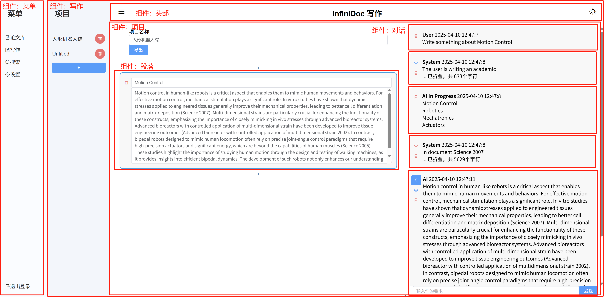
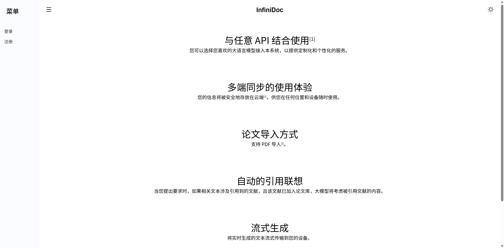
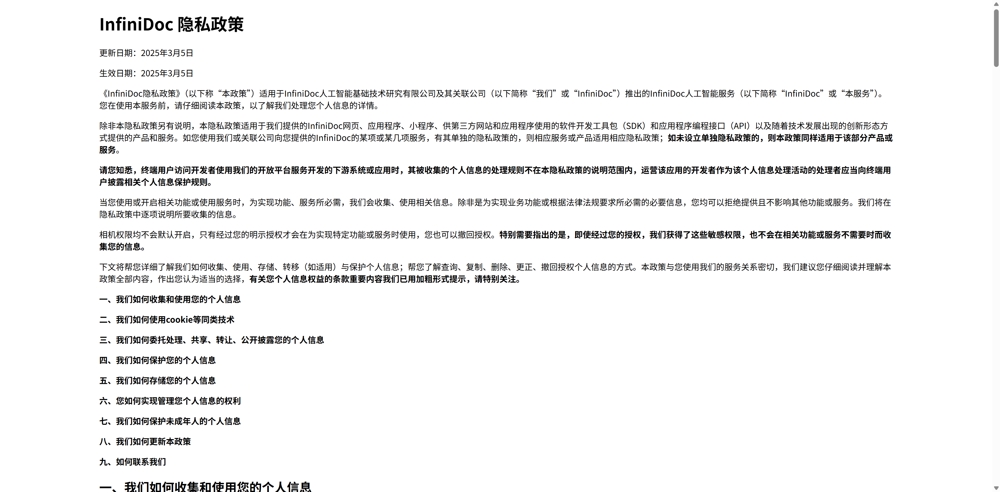
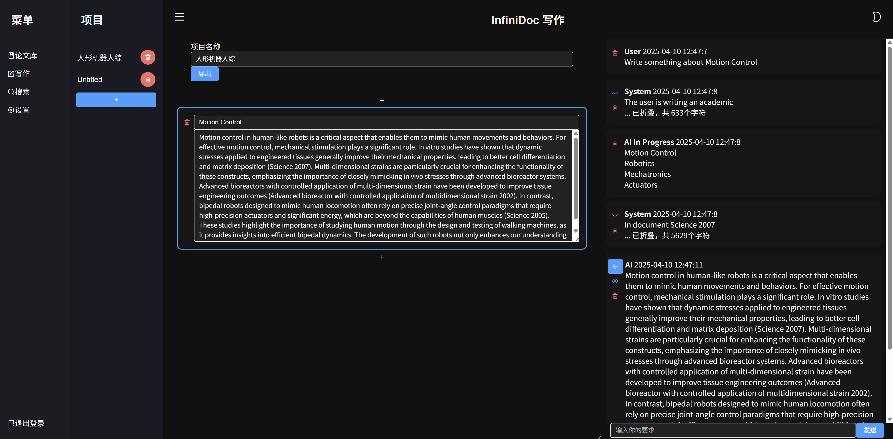
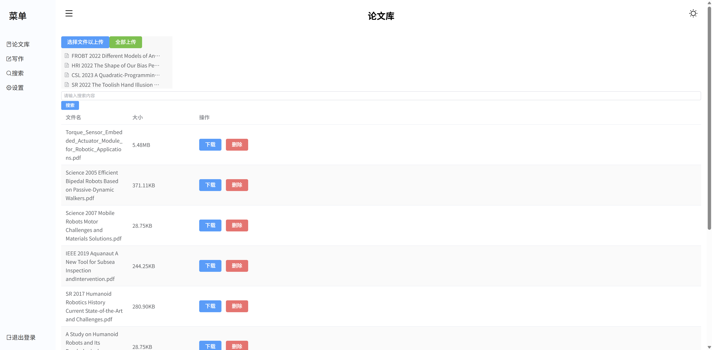
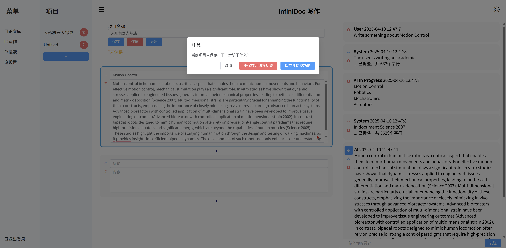
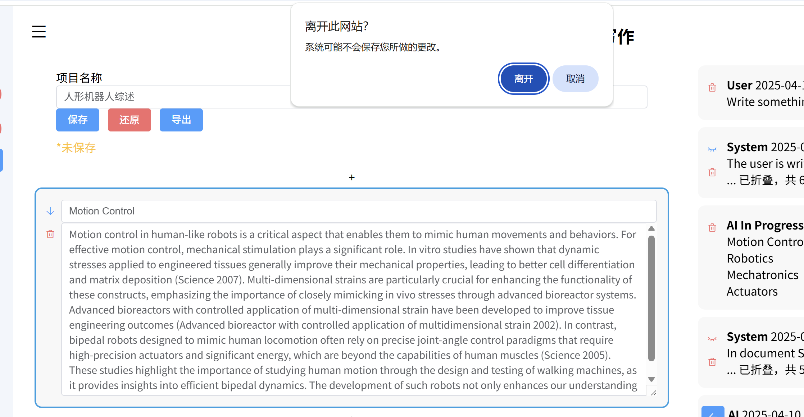

# 前端文档

## 项目文件结构

-   components/

    -   NotLoggedInView.vue 登录前主页面
    -   NotLoggedInMenu.vue 登录前的侧边菜单
    -   PrivacyPolicy.vue 隐私政策页面
    -   headBar.vue 头部
    -   LoginView.vue 登录页面
    -   RegisterView.vue 注册页面
    -   HomeView.vue 登录后主页面
    -   Menu.vue 登录后侧边菜单
    -   Chat.vue 写作的主页面
    -   ChatSelect.vue 写作左面的选择项目列表
    -   Project.vue 项目的主页面
    -   Dialog.vue 单个对话
    -   Paragraph.vue 单个段落
    -   Papers.vue 论文库的主页面
    -   Search.vue 搜索的主页面
    -   SearchResultCard.vue 搜索结果卡片
    -   Setting.vue 设置的主页面
    -   endpoints.js 用于定义 API 地址
    -   tauth.js 用于处理用户认证

-   css/

    -   homestyle.css 用于处理登录后页面的样式
    -   style.css 用于处理整体的样式
    -   loginstyle.css 用于处理登录页面的样式
    -   vscode-darkplus.css 代码高亮样式
    -   docstyle.css 隐私政策样式

## 技术栈

-   使用 Vue3 作为前端框架
-   使用 Webpack 作为构建及调试工具
-   使用 Element Plus 作为 UI 组件库
-   使用 Babel 作为编译器
-   使用 marked 作为 Markdown 解析器
-   使用 highlight.js 作为代码高亮工具

## 页面结构

总地来说，路径一共有 5 个：

-   登录前页面
-   登录页面
-   注册页面
-   条款页面
-   登录后页面（主页面）

其中在主页面内的组件实现了功能切换，但并不会改变路径。

可能切换的组件有：

-   设置
-   论文库
-   搜索
-   写作

复用的组件有：

-   头部，通过 Slot 传入不同的标题
-   侧边菜单
-   对话（即一个聊天）文字过长时自动折叠（会自动识别单词，不会在单词中间折叠）
-   段落
-   搜索结果卡片

## 实现功能

### 深色模式

实现了深色和浅色两套配色，进入页面时根据用户的系统设置自动选择深色或浅色模式，用户可以在页面右上角手动切换深色和浅色模式。

### 画面过渡

使用 Vue 的过渡组件实现了页面切换时的过渡效果，使用 CSS 的 transition 属性实现了元素的过渡效果。

### 弹性布局

使用 CSS 的 Flexbox 实现了页面的弹性布局。通过设置元素的 `display: flex` 和 `flex-direction` 属性实现了元素的排列方式。

另外，使用了 `resize` 属性，支持用户拖动更改各个组件的大小。

### 上传页面

使用 Element Plus 的 Upload 组件实现了文件上传功能，支持拖拽上传和点击选择文件上传。

### Websocket 实现 LLM 的流式推理

使用 Websocket 实现了 LLM 的流式推理，使用了 Vue 的响应式系统实现了数据的双向绑定。当接收到 Websocket 数据包时，将数据包中的数据解析并更新到页面上。

### 打断切换

当用户有改动未保存时，点击切换组件会弹出提示框，询问用户是否保存改动，也会 hook 浏览器关闭事件，询问用户是否确定离开。

## API 调用

在 localStorage 中存储了 Token，在每次请求时从 localStorage 中获取 Token，并将 Token 添加到请求头中。

每次打开页面时，前端会自动校验 Token 的有效性，如果 Token 无效，则跳转到登录页面。

## 编辑器

本项目的思想是一个 Web App，因此在编辑的全程（除非调用接口）是无需与后端交互的。在导出时，前端可以将内容生成一个 Markdown，但对于其他格式，会调用后端接口提供格式转换。
